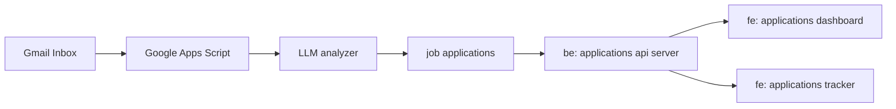

# Job Application Tracker

## Intro

This application is intended to analyze and track job application status by scan through a lis of email applications
and responses from users' inbox.  It uses LLM to analyze email threads, generates useful data which can be aggregated
for insights such as total number of applications sent, responses received, turn around time to receive a response ... 

## Workflows

### Ingest Raw Data

This is accomplished by running Google App Script attached to user's Gmail inbox remotely. 
The Google App Script applies a set of email filters to extract job applications emails, which allows the following information extracted: 

| Field  | Description |
| ------------- | ------------- |
| SentTime  | Received timestamp (Local Time) for a job application |
| Subject | Subject of the job application confirmation email  |
| FullSender | Sender name and email address of the job application confirmation email |
| Domain | Domain of the job application confirmation email |

The following fields are added to each job application record generated by LLM module : 

| Field  | Description |
| ------------- | ------------- |
| Company  | Company candidate applied for |
| Position | Job position being applied for|
| Status | Status of application, ie. Pending, Success, Reject  |