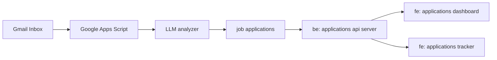

# Job Application Tracker

## Intro

This application is intended to track job application progress by extracting job application statistics based on 
application email responses. It uses LLM to analyze email threads, generates useful data which can be aggregated
to produce insights such as total number of applications sent, number of applications sent per company, the turnaround 
time for applications, number of applications resulting in various types of interviews, etc...

## Workflows

### Ingest Raw Data

This is accomplished by running Google App Script attached to user's Gmail inbox remotely. 
The Google App Script applies a set of email filters to extract job applications confirmation 
emails. Based on the confirmation email threads. The following information are extracted: 

| Field  | Description |
| ------------- | ------------- |
| SentTime  | Received timestamp (Local Time) for a job application |
| Subject | Subject of the job application confirmation email  |
| FullSender | Sender name and email address of the job application confirmation email |
| Domain | Domain of the job application confirmation email |

It consumed about &cent;20 ~ &cent;30 worth of Openai tokens to scan through 300 matching email records.